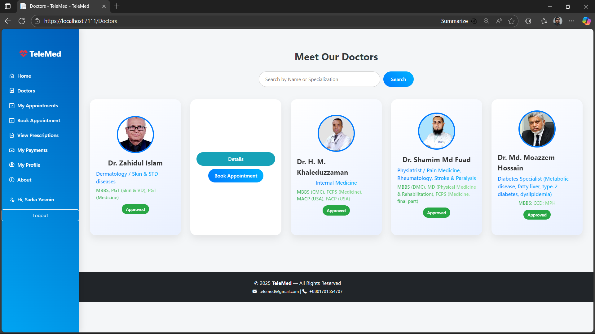
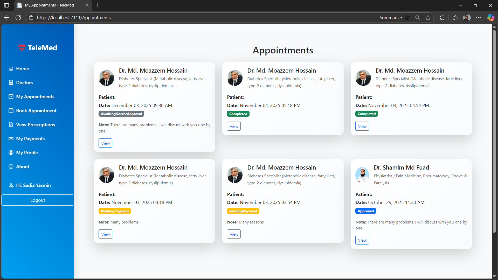

# 🩺 TeleMed – Online Healthcare Management System

**TeleMed** is a modern web-based telemedicine platform built with **ASP.NET Core MVC**.  
It connects doctors and patients for **virtual consultations**, enabling features like **online appointments, prescription management, video sessions**, and **role-based access control** for Admins, Doctors, and Patients.

---
## 📸 Screenshots

| Home Page | Doctor Dashboard | Appointment View |
|------------|------------------|-------------------|
|  |  |  |

---

## 🚀 Features

### 👨‍⚕️ For Doctors
- View and manage appointments
- Add and edit prescriptions after video sessions
- Upload digital prescriptions for patients to view or download
- Manage personal schedules and availability

### 🧑‍🤝‍🧑 For Patients
- Book and manage appointments
- Join virtual sessions with doctors
- View and download uploaded prescriptions
- Access profile and appointment history

### 🧑‍💼 For Admins
- Manage doctors and patient lists
- Approve pending doctor and schedule requests
- View reports and payment summaries

---

## 🛠️ Tech Stack

| Category | Technologies |
|-----------|---------------|
| **Framework** | ASP.NET Core MVC 8 |
| **Frontend** | Razor Pages, Bootstrap 5, jQuery |
| **Database** | Entity Framework Core (SQL Server) |
| **Authentication** | ASP.NET Identity (Role-based) |
| **PDF Generator** | QuestPDF |
| **File Storage** | wwwroot/uploads/prescriptions/ |

---

## ⚙️ Installation & Setup

### 1️⃣ Clone the repository
    git clone https://github.com/yourusername/TeleMed.git
    cd TeleMed
### 2️⃣ Open in Visual Studio
Open the .sln file in Visual Studio 2022 or later.
Make sure you have .NET 8 SDK installed.

### 3️⃣ Configure Database
Update your appsettings.json connection string if needed.
Run migrations and update the database:
      
      git clone https://github.com/yourusername/TeleMed.git
      cd TeleMed
### 4️⃣ Run the Application
Press F5 or run:
     
      dotnet run
      
Visit https://localhost:5001 (or the port shown in console).

👨‍💻 Author
Abir Hasan
